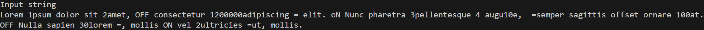
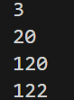

# TPC1

### Data de entrega: 14/02/2025
### Autor: Luís França A104259

---

### Resumo
Enunciado do Problema: 
"Pretende-se um programa que some todas as sequências de dígitos que encontre num texto;
Sempre que encontrar a string “Off” em qualquer combinação de maiúsculas e minúsculas, esse comportamento é desligado;
Sempre que encontrar a string “On” em qualquer combinação de maiúsculas e minúsculas, esse comportamento é novamente ligado;
Sempre que encontrar o caráter “=”, o resultado da soma é colocado na saída."
Para resolver este problema desenvolvi um ciclo _while_ que faz _parsing_ à string dada como input caracter a caracter até o seu fim, dentro deset ciclo há 3 verificações principais. 
- Se o caracter for 1 dígito continua a ler os dígitos até acabarem e soma o valor resultanto ao acumulador depois de o converter em um inteiro. Esta verificação só acontece se um booleano "active" tiver o valor de _True_.
- Se o caracter for a letra "o" o programa verifica se a palavra é "on" ou "off" de uma maneira case insensitive. Além disse verifica se a palavra está isolada assim ignorando casos que "on" ou "off" façam partes de outras palavras (exemplo: "only" ou "offset"). Se for detetado "ON" active é tornado _True_, se for detetado "OFF", active torna-se _False_.
- Se o caracter "=" for detetado é imprimido o valor resultante no terminal.
Utilizando a seguinte string de Input.

Obtive o seguinte output:

Pode-se verificar que o programa fez a soma 1+2 = 3 +3+4 = 20 +100 = 120 +2 = 122; ou seja o programa ignorou valores de números que estavam depois do OFF e antes de um ON, além disso ignorou o "off" na palavra "offset".

